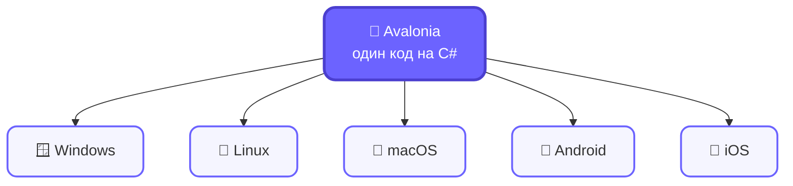

# Слайд 1

## Текст для слайда (копировать в PPT)

Avalonia UI
Кроссплатформенный фреймворк для .NET

Windows · Linux · macOS · Android · iOS
Один код — все платформы

## Схема

## Заметки лектора

Начать с вопроса аудитории: "Кто писал под Windows Forms или WPF?" — большинство поднимет руки. Дальше связка: "А что если я скажу, что тот же подход, тот же XAML, тот же MVVM — можно применить и на Linux, и на macOS, и даже на телефоне?"

Показать схему платформ и проговорить: в центре — один код на C#, который расходится на 5 платформ без переписывания UI-слоя. Подчеркнуть словом "один код" — это главная ценность, которую нужно донести в первые 30 секунд.

Не углубляться в детали архитектуры — это будет на следующих слайдах. Здесь только hook: "почему это круто и зачем нам это надо".

Если аудитория из WPF-разработчиков — сказать явно: "если вы писали на WPF, вы уже 80% знаете Avalonia".
