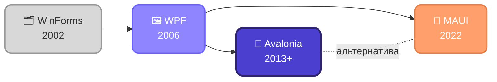

# Слайд 2

## Текст для слайда (копировать в PPT)

Эволюция UI-фреймворков .NET

WinForms → WPF → Avalonia → MAUI

Avalonia — альтернатива MAUI

## Схема

## Заметки лектора

Даты: WinForms — 2002 (с самого .NET Framework 1.0), WPF — 2006 (.NET Framework 3.0), Avalonia — первые версии около 2013–2015, активное развитие с 2019+, MAUI — 2022, преемник Xamarin.Forms.

WinForms — обёртка над Win32 API, событийная модель, без XAML. Legacy, но встречается на старых проектах.

WPF — первый принёс XAML, Binding, MVVM, аппаратный рендеринг через DirectX. Жёстко привязан к Windows.

Avalonia — переосмысление WPF: тот же XAML/MVVM-подход, но свой рендерер (Skia), не зависящий от ОС. Не форк WPF, отдельный проект с нуля.

MAUI — от Microsoft, преемник Xamarin.Forms, использует нативные контролы каждой платформы (не единый рендер, как в Avalonia).

Таблица отличий Avalonia vs MAUI (держать в голове, если спросят):
- Рендеринг: Avalonia — свой (Skia, одинаково всюду) / MAUI — нативные контролы платформы
- Фокус: Avalonia — desktop-first / MAUI — исторически mobile-first
- Переход с WPF: у Avalonia почти бесшовный, у MAUI больше отличий
