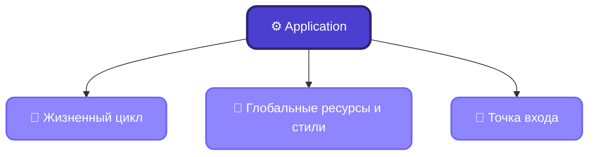

# Слайд 3

## Текст для слайда (копировать в PPT)

Архитектура Avalonia

Application → Window → Controls → Rendering

Application
Управляет жизненным циклом приложения
Хранит глобальные ресурсы и стили
Определяет точку входа (главное окно)

## Схема

## Заметки лектора

Application — единственный экземпляр на приложение (singleton), точка входа — метод OnFrameworkInitializationCompleted.

Жизненный цикл: Initialize → OnFrameworkInitializationCompleted → показ главного окна → работа приложения → завершение (Shutdown).

Application.Resources — глобальный словарь ресурсов (цвета, стили, шаблоны), доступный из любого View через StaticResource/DynamicResource.

В App.axaml обычно подключают тему (Fluent, Default) и глобальные стили через `<Application.Styles>`.

Различие desktop/mobile точки входа: для desktop — ClassicDesktopStyleApplicationLifetime (создаёт Window), для мобильных — SingleViewApplicationLifetime (создаёт единственный View без окна).
