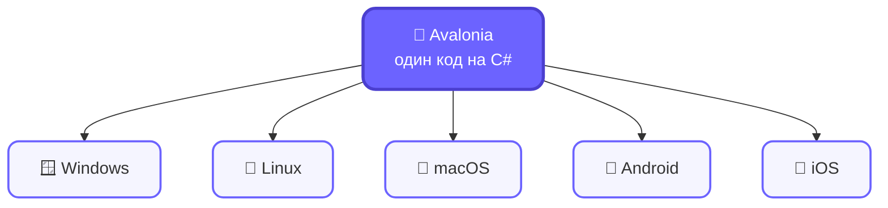
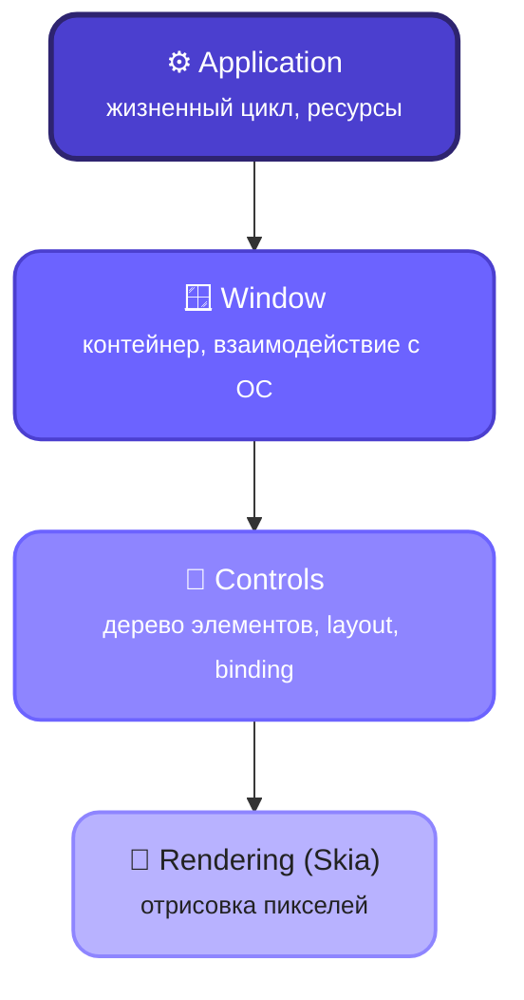

# Тестовая схема Mermaid (v2 — стилизация)

## Платформы Avalonia

```mermaid
graph TD
    Core["🎯 Avalonia<br/>один код на C#"]
    Core --> Win["🪟 Windows"]
    Core --> Lin["🐧 Linux"]
    Core --> Mac["🍎 macOS"]
    Core --> And["🤖 Android"]
    Core --> Ios["📱 iOS"]

    classDef core fill:#6C63FF,stroke:#4B3FCF,stroke-width:3px,color:#fff,rx:12,ry:12
    classDef platform fill:#F5F5FF,stroke:#6C63FF,stroke-width:2px,color:#333,rx:10,ry:10

    class Core core
    class Win,Lin,Mac,And,Ios platform
```

## Архитектура Avalonia (стилизованный вариант)

```mermaid
graph TD
    App["⚙️ Application<br/><small>жизненный цикл, ресурсы</small>"]
    Win["🪟 Window<br/><small>контейнер, взаимодействие с ОС</small>"]
    Ctrl["🧩 Controls<br/><small>дерево элементов, layout, binding</small>"]
    Render["🎨 Rendering (Skia)<br/><small>отрисовка пикселей</small>"]

    App --> Win --> Ctrl --> Render

    classDef appStyle fill:#4B3FCF,stroke:#2E2470,stroke-width:3px,color:#fff,rx:14,ry:14
    classDef winStyle fill:#6C63FF,stroke:#4B3FCF,stroke-width:2px,color:#fff,rx:14,ry:14
    classDef ctrlStyle fill:#8E85FF,stroke:#6C63FF,stroke-width:2px,color:#fff,rx:14,ry:14
    classDef renderStyle fill:#B8B2FF,stroke:#8E85FF,stroke-width:2px,color:#222,rx:14,ry:14

    class App appStyle
    class Win winStyle
    class Ctrl ctrlStyle
    class Render renderStyle
```
